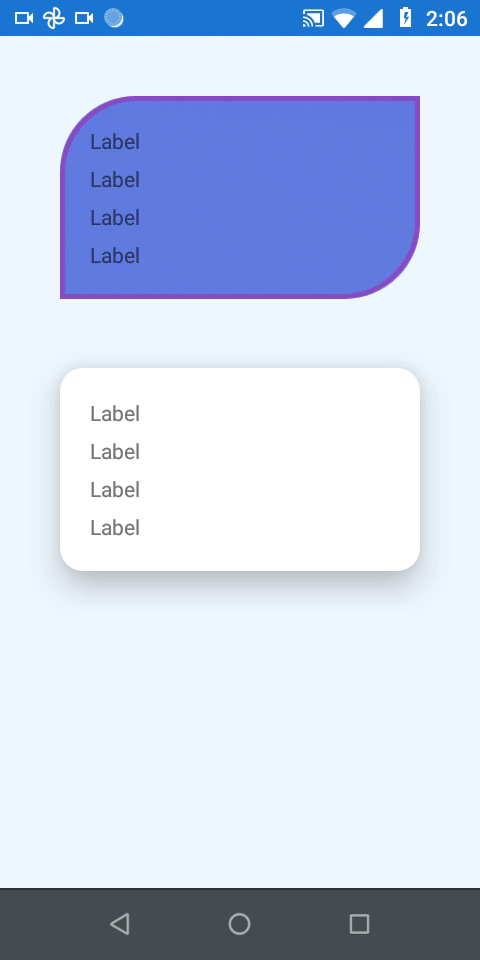

[](https://www.nuget.org/packages/Haka.Renderers)


## Haka.Renderers

Set of custom controls with renderers for Xamarin.Forms

### NuGet installation

Install the [Haka.Renderers NuGet package](https://www.nuget.org/packages/Haka.Renderers):

```powershell
PM> Install-Package Haka.Renderers
```

## Overview

### Frame Ripple


```xml
<hkRenderers:FrameRipple
    BackgroundColor="#AEDDC9"
    BorderColor="#F58996"
    BorderWidth="5"
    CornerRadius="50, 0"
    Margin="20"
    Padding="20"
    RippleColor="Blue"
    >
</hkRenderers:FrameRipple>

<hkRenderers:FrameRipple
    BackgroundColor="#FFF"
    BorderColor="Blue"
    CornerRadius="15"
    Elevation="10"
    Margin="20"
    Padding="20"
    >
</hkRenderers:FrameRipple>
```
Properties:

| Property
| --- |
| BorderWidth |
| CornerRadius |
| Elevation |
| RippleColor |
| Tap |
| OnTap |

